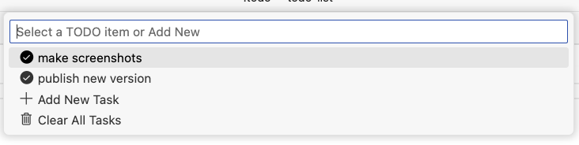

# TODO List in Command Palette

Manage a TODO list directly within the editor 

## Features

*   **Add Tasks:** Quickly add new TODO items via an input box (`todo-list.addTodo`).
*   **View & Manage Tasks:** Access your TODO list through a Quick Pick menu (`todo-list.showList`).
    *   Click on a task to toggle its status between pending and done.
    *   Done tasks are marked with `[DONE]` and moved below pending tasks.
    *   An "Add New Task" option is available directly in the list view.
    *   A "Clear All Tasks" option allows you to remove all items after confirmation.
*   **Plain Text Storage:** Your TODO list is saved as plain text in a `.todo` file in your workspace root. You can directly edit this file, and the extension will automatically reload the changes.
*   **Status Bar Integration:** Shows the latest pending task in the status bar. Clicking it opens the TODO list. Shows "All tasks done!" when the list is empty or all tasks are completed.

Describe specific features of your extension including screenshots of your extension in action. Image paths are relative to this README file.

For example if there is an image subfolder under your extension project workspace:

\!\[feature X\]\(vs-todo-list.png\)
\!\[Screenshot\]\(screen2.png\)

> Tip: Many popular extensions utilize animations. This is an excellent way to show off your extension! We recommend short, focused animations that are easy to follow.

## Requirements

If you have any requirements or dependencies, add a section describing those and how to install and configure them.

## Extension Settings

This extension does not currently add any specific settings.

## Known Issues

Calling out known issues can help limit users opening duplicate issues against your extension.

## Release Notes

Users appreciate release notes as you update your extension.

### 0.1.0 (Current)
- Add basic TODO list functionality: add, view, toggle done/pending.
- Save list to `.todo` file in the workspace.
- Status bar integration showing the latest task.
- Added a "Clear All Tasks" option with confirmation.

